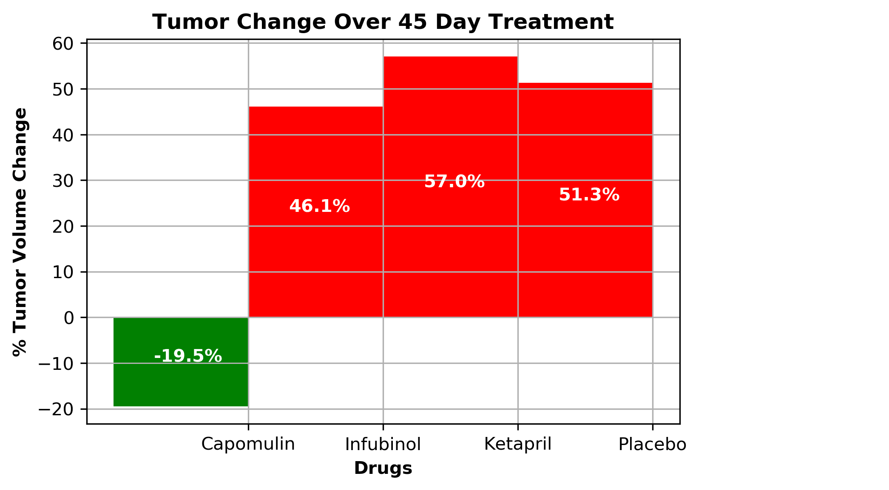

# Matplotlib - Drug Treatment for Cancer

---

## Project Description

The purpose of the project was to use the Python Matplotlib Library to create plots exploring the results of using different drug treatments against cancer.
